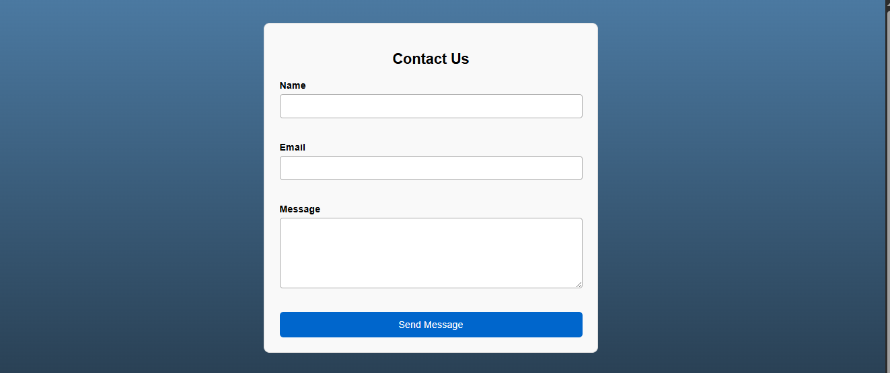
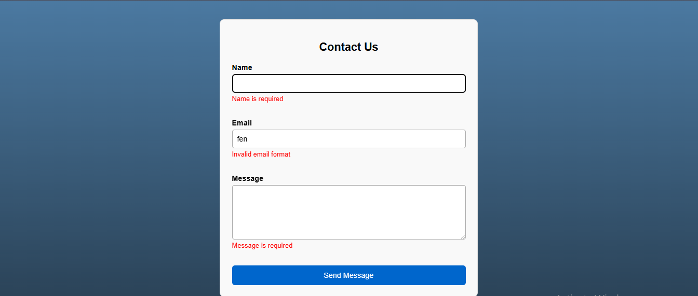
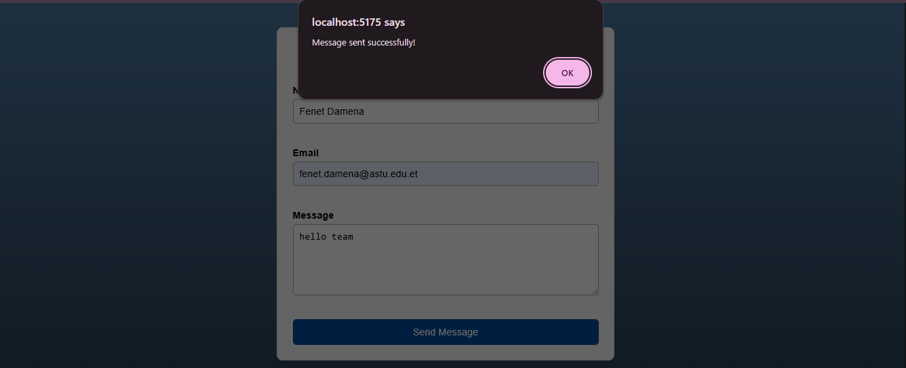

# Contact Form using React Hook Form (TypeScript)

This project is a simple and responsive contact form built with **React**, **TypeScript**, and **react-hook-form**. It demonstrates how to manage form state, perform validation, and handle submission in a clean and efficient way using the `useForm` hook.

##  Features

- Built with **React + TypeScript**
- Form state management using `useForm`
- Real-time validation and error messages
- Email format validation using regular expressions
- Responsive UI styled with plain CSS
- Alert and console output on successful form submission

##  Technologies Used

- React
- TypeScript
- react-hook-form
- Vite (for fast development)
- CSS (global styling in `index.css`)

##  Validation Rules

- **Name**: Required field
- **Email**: Required field with valid email format
- **Message**: Required field

If any of the fields are invalid or empty, relevant error messages will be shown below the input.

##  Getting Started

### Prerequisites

Ensure you have the following installed:

- Node.js (v14 or later)
- npm (v6 or later)

### Installation

1. Clone the repository:

   ```bash
   git clone https://github.com/Fenet-damena/A2sv-task-5.git
   cd A2sv-task-5
   ```

2. Install dependencies:

   ```bash
   npm install
   ```

3. Run the development server:

   ```bash
   npm run dev
   ```

4. Open the app in your browser:

   ```
   http://localhost:5173/
   ```

##  Testing Instructions

1. Try submitting the form with empty fields to see validation messages.
2. Enter an invalid email to trigger format error.
3. Fill in all fields correctly and submit — an alert will confirm success and the data will be logged in the browser console.

## 📸 Screenshots

###  1. Initial Contact Form UI

This shows the clean and responsive UI with three input fields: Name, Email, and Message.


### ❌ 2. Validation Error Messages

Displays error messages for required fields and invalid email format.


### ✅ 3. Successful Submission

After filling in valid data and submitting, a success alert appears, and the form data is logged in the console.


##  Author

**Fenet Damena**
